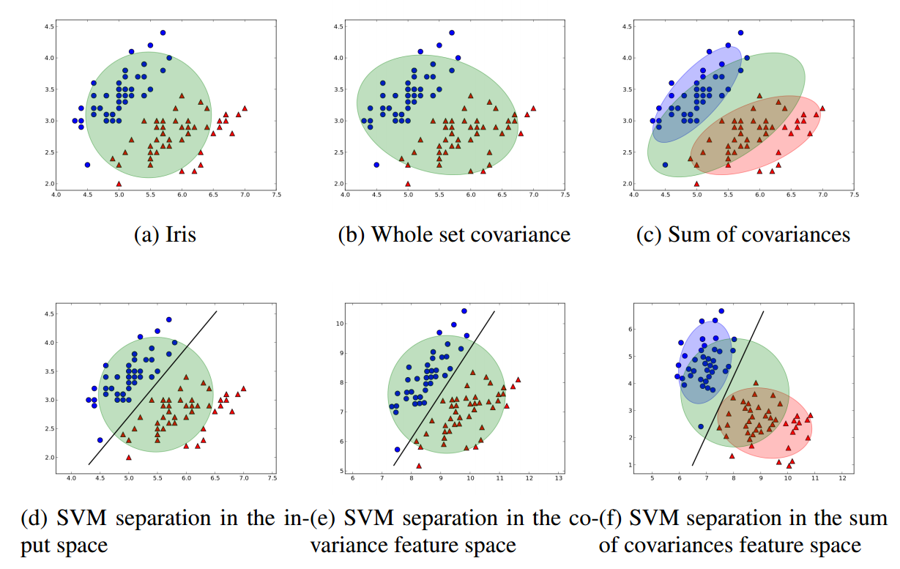
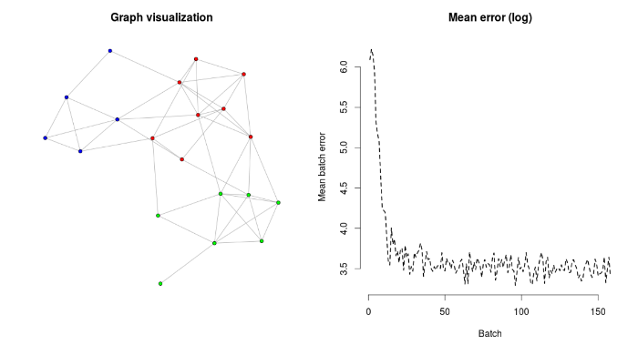

#gmum.R

gmum.R is a package consisting in various models. We focus on efficiency (underlying C++ implementation) and easy of usage.
gmum.r is a close collaboration between GMUM group members (<a href="http://gmum.net">http://gmum.net</a>) and students.

Package includes three subpackages:

* SVM with various underlying libraries and modifications
* Cross Entropy Clustering (CEC) clustering algorithm
* Growing Neural Gas clustering algorithm

## SVM

SVM Wrapper is a part of the gmum.R project which provides a popular Support Vector Machine inplementations wrapped in the R package.

<small>2e Iris example</small>
<center></img></center>


### Example usage

```R
library('gmum.r')

# Load a dataset, here we have provided an example 
data(svm_breast_cancer_dataset)
ds <- svm.breastcancer.dataset

# Create new SVM object
svm <- SVM( formula = X1~. ,
            data = ds,
            lib = "libsvm",
            kernel = "linear",
            prep = "none",
            C = 10) 

# You can access the dataset 
x <- dataset.X(svm)
y <- dataset.Y(svm)

# Classify your dataset using predict function
prediction <- predict(svm, x)

# Check models accuracy
acc <- svm.accuracy(prediction=y, target=prediction)
```

## Growing Neural Gas

Subpackage containing **efficient**, **online** GNG algorithm. It produces topological graph, that you can easily convert to igraph, or you can
dump your model to optimized binary file and load it later on.

<small>Clustering of the UCI wine dataset</small>
<center></img></center>

### Example: cluster wine dataset

In this example we will construct a clustering of UCI wine dataset using offline GNG.

```R
library(gmum.r)

# Load data
data(wine, package="rattle")
scaled_wine <- scale(wine[-1])

# Train in an offline manner
gng <- GNG(scaled_wine, labels=wine$Type, max.nodes=20)

# Find closest node to vector [1,1,1]
predict(gng, c(1,1,1))

# Find mean error
meanError(gng)

# Plot with first 2 coordinates as position
plot(gng, mode=gng.plot.2d.errors, vertex.color=gng.plot.color.cluster, 
     layout=gng.plot.layout.igraph.fruchterman)
```

## Cross Entropy Clustering

CEC aims to efficiently implement Cross Entropy Clustering Algorithm as R extension.

Cross-entropy clustering (shortly CEC) joins advantages of classical k-means with those of EM. Moreover, contrary to k-means and EM, CEC **finds the optimal number of clusters** by automatically removing redundant ones.

<small>CEC clustering</small>
<center></img></center>


### Example usage

```R
library(gmum.r)

data(cec_mouse_1_spherical)
dataset = input

# That is the dataset we want to cluster
plot(dataset)

# Run cec with default parameters. Set the number of clusters and the dataset.
c <- CEC(k=3, x=dataset)
plot(c)

# Since initial clusterization is random. It may be a good idea to run cec multiple times and choose the best result.
c <- CEC(k=3, x=dataset, control.nstart=10)
plot(c)

# Better than before, however, we know that clusters are spherical; let's inform cec about that.
c <- CEC(k=3, x=dataset, control.nstart=10, method.type='sphere')
plot(c)

# You can learn details of clustering like this
centers(c)
covMatrix(c)

# You can predict cluster which a point would belong to:
predict(c, c(1,1))

# You can visualise size and shape of clusters
plot(c, ellipses=TRUE)

# Try the same with random assignment
c <- CEC(k=3, x=dataset, control.nstart=10, method.type='sphere', method.init='random')
plot(c)
```

