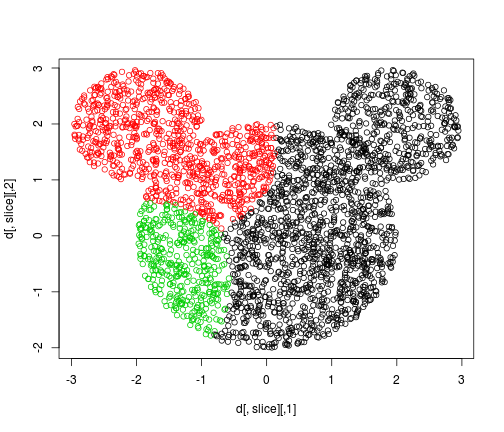
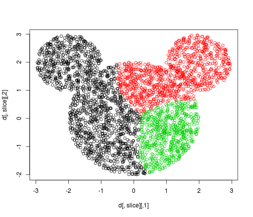
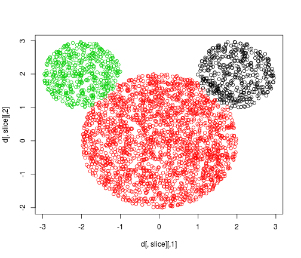
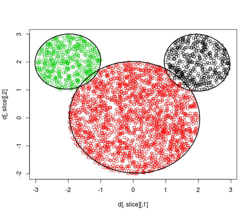
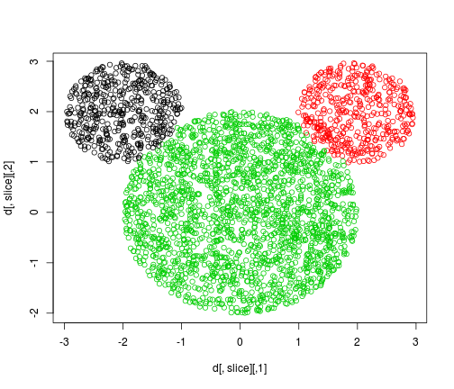

Cross Entropy Clustering
========================================================

Part of gmum.R project. See gmum research group page [here](http://gmum.ii.uj.edu.pl) .

General
------

CEC aims to efficiently implement Cross Entropy Clustering Algorithm as R extension.

CEC demo
------


```r
library(devtools)
load_all('../')
```

```
## Loading gmum.r
## Loading required package: Rcpp
## Loading required package: RcppArmadillo
## Creating a new generic function for 'cov' in package 'gmum.r'
## Creating a generic function for 'plot' from package 'graphics' in package 'gmum.r'
## Creating a generic function for 'print' from package 'base' in package 'gmum.r'
## Creating a generic function for 'summary' from package 'base' in package 'gmum.r'
```

```r
dataset <- as.matrix(read.table("../tests/cpp/data/mouse_1_spherical/input.txt"))
```
that is the dataset we want to cluster

```r
plot(dataset)
```

 

run cec with default parameters


```r
args <- list(k=3, x=dataset)
c <- CEC(args)
plot(c)
```

 

since initial clusterization is random it may be a good idea to run cec multiple times and choose the best result


```r
args <- list(k=3, x=dataset, params.nstart=10)
c <- CEC(args)
plot(c)
```

 

better than before, however, we know that clusters are spherical; let's inform cec about that


```r
args <- list(k=3, x=dataset, params.nstart=10, method.type='sphere')
c <- CEC(args)
plot(c)
```

 

you can learn details of clustering like this


```r
centers(c)
```

```
## [[1]]
## [1] 1.957193 1.974472
## 
## [[2]]
## [1] 0.03909274 0.02175208
## 
## [[3]]
## [1] -2.012686  2.016024
```

```r
cov(c)
```

```
## [[1]]
## [1]  0.254579374 -0.007326478 -0.007326478  0.258511736
## 
## [[2]]
## [1]  1.00163190 -0.02665602 -0.02665602  0.99577141
## 
## [[3]]
## [1] 0.2548147 0.0119440 0.0119440 0.2425556
```

you can predict cluster which a point would belong to


```r
predictCluster(c, c(1,1))
```

```
## [1] 1
```

or find out what are the probabilities of belonging to each cluster


```r
predictClusters(c, c(1,1))
```

```
## [1] 1.469839e-02 6.059977e-02 7.421924e-10
```

you can visualise size and shape of clusters


```r
plot(c, ellipses=TRUE)
```

 

```
##              [,1]         [,2]
## [1,]  0.254579374 -0.007326478
## [2,] -0.007326478  0.258511736
##             [,1]        [,2]
## [1,]  1.00163190 -0.02665602
## [2,] -0.02665602  0.99577141
##           [,1]      [,2]
## [1,] 0.2548147 0.0119440
## [2,] 0.0119440 0.2425556
```

try the same with random assignment


```r
args <- list(k=3, x=dataset, params.nstart=10, method.type='sphere', method.init='random')
c <- CEC(args)
plot(c)
```

 
