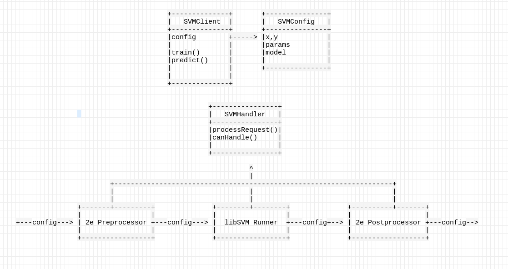
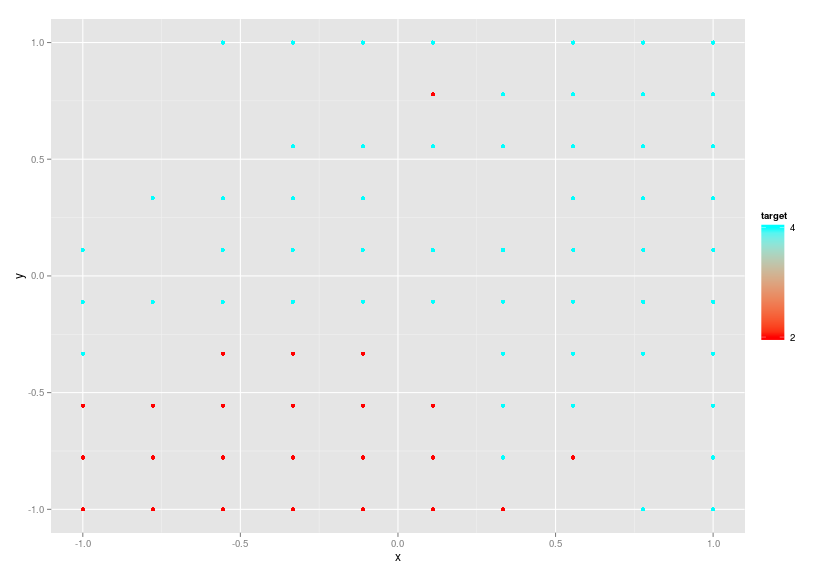

## Moduł SVM

# Idea

* Pakiet umożliwiający korzystanie z wielu różnych dystrybucji SVM

* Typowy interfejs języka R

* Informacje o modelu

* parametryzacja

* uczenie wieloklasowe

* funkcje pomocniczne

--- .class #id 
## Zespół

* Piotr Kowenzowski - projekt architektury, libSVM
* Kamil Kuś, Agnieszka Pocha, później Mateusz Bruno-Kamiński - 2eSVM
* Konrad Talik - Git Master, SVMLight
* Igor Sieradzki - architektura, interfejs R
* Stanisław Jastrzębski - Nadzorca

--- .class #id 
## Architektura 



--- .class #id 
## Interfejs R

# Główna funkcja 

```R
SVM <- function(x = svm.breast_cancer.x(), 
                y = svm.breast_cancer.y(),
                lib = "libsvm",
                kernel = "rbf",
                prep = "none",
                mclass = "none",
                C = 1,
                gamma = 0,
                coef0 = 0,
                degree = 3,
                shrinking = TRUE,
                probability = FALSE,
                cweights = NULL,
                sweights = NULL,
                cache_size = 100,
                tol = 1e-3 ) 
```

--- .class #id 
## Interfejs R

# Wczytywanie zbioru Danych
```R
  load.dataset <- function( object, x ) {
    object$setX( x[,c( seq(1, ncol(x) - 1,1))] )
    object$setY( x[,c(ncol(x))] )
  }
  
  > model = SVM()
  > load_dataset(model, dataset)
```
# Zmiany Parametrów
```R
params.svm.C <- function(object, x) {
    check.trained(object)
    object$setC(x)
  }
  
  > params.C(model,100)
  or
  > model$setC( 100 )
```

--- .class #id 
## Interfejs R

# Print
```R
  print.svm <- function(x) {
    print(sprintf("SVM object with: library: %s, kernel: %s, preprocess: %s, C: %.1f, 
                   gamma: %.3f, coef0: %.3f, degree: %d",
                  x$getLibrary(),
                  x$getKernel(),
                  x$getPreprocess(),
                  x$getC(),
                  x$getGamma(),
                  x$getCoef0(),
                  x$getDegree() ))
  }
  
  > print(model)
  [1] "SVM object with: library: libsvm, kernel: rbf, preprocess: none, C: 1.0,
      gamma: 0.000, coef0: 0.000, degree: 3"
```

--- .class #id 
## Interfejs R

# Plot
```R
    plot.svm <- function(object, dim1 = 1, dim2 = 2) {
    x = object$getX()
    if (dim1 > ncol(x) || dim2 > ncol(x)) {
      stop("Too large dimensions")
    }
    plot2d.svm(object,dim1,dim2)
  }
  
  > plot(model, 2, 3)
  
```

--- .class #id 
## Plot BreastCancer, wymiary: 2,3



--- .class #id

## Interfejs R

# Train

```R
  train.svm <- function(object) {
    object$train()
  }
  
  > train(model)
```

# Predict

```R
  predict.svm <- function(object, x) {
    object$predict(x)
    prediction = object$getPrediction()
    prediction
  }
  
  > prediction = predict(model, test_data)
```

--- .class #id

## Koniec


